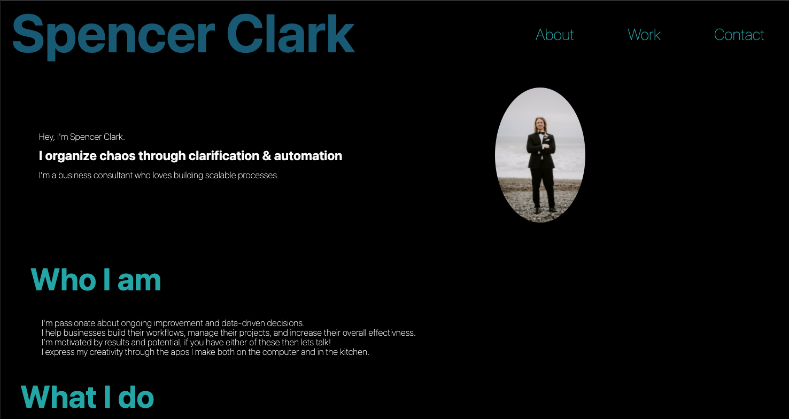
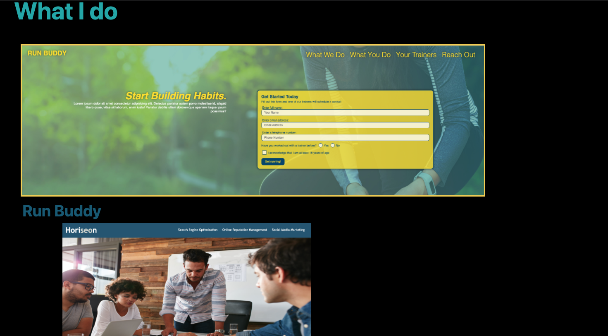
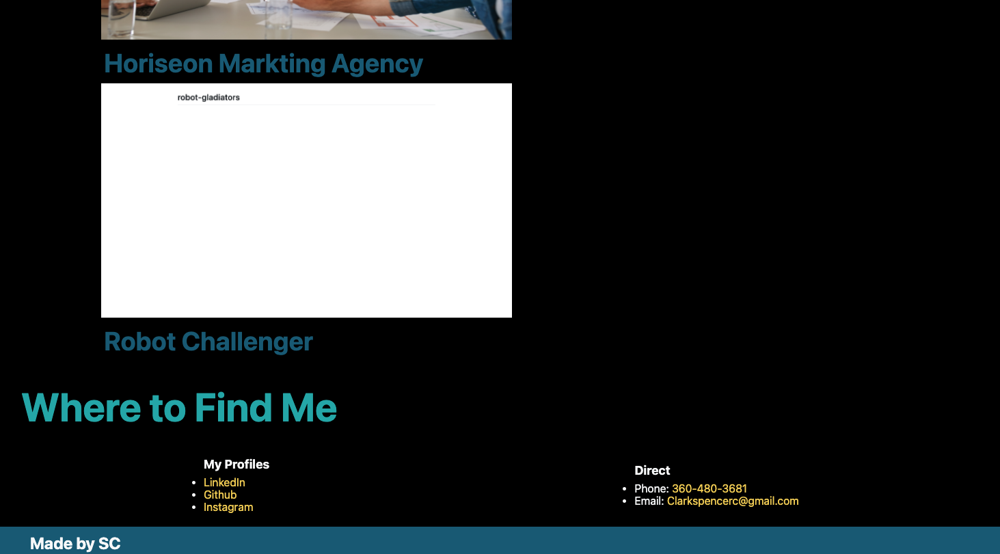
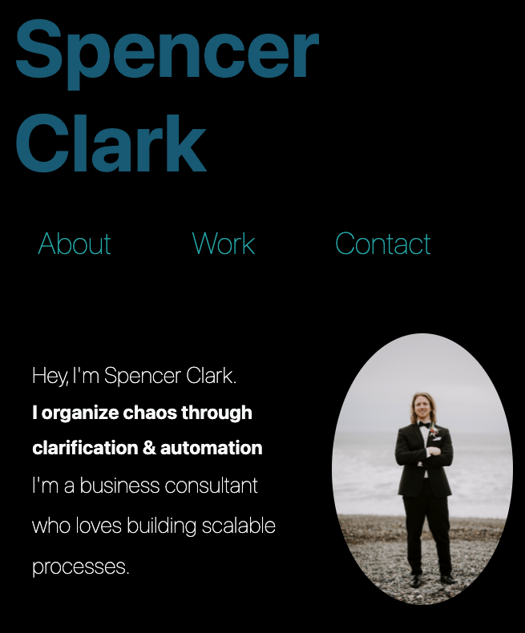
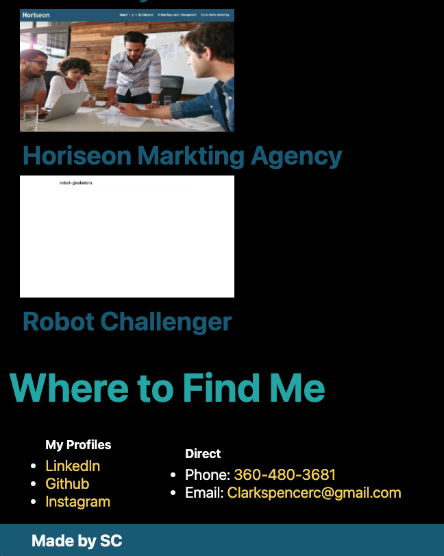

# Spencer Clark's portfolio 

## Purpose 
A webiste to display the projects I have completed and my contact information 

## Problems Solved 
I needed my website to be adaptable to any size screen and have the elements shift and adjust. I used flexboxes and media quieres to solve this problem because flexboxes are great for figuring out responsive spacing. Media quieres were used to account for multiple screen sizes and adjusting certian elements to display differently given the screen size. 

## Lessons Learned 
I learned the benefits of flexbox and media quieres. 

## Challenges 
Figuring out all of the flexbox properties was a little challenging. There were a few times were I thought I had programed the "What I Do" section to appear how I planned on it but the page was not reacting accordingly. I kept refactoring the code both in the CSS and HTML files to get the results I am hoping for. 

## Built with 
* HTML
* CSS 

## Website 
https://clarkspencerc.github.io/portfolio/

## Screenshots of webiste
Top of website full screen

Middle of website full screen 

Bottom of website full screen 

Phone size top 

Phone size bottom 

## Contribution 
Made by Spencer Clark 